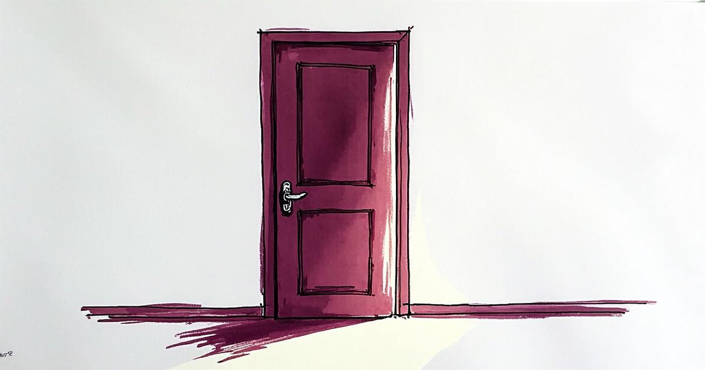

# The Opening

---

There is a current running through everything that works. It moves in one direction: open.

## The Philosophical Case

The pattern is old. Berlin Wall, trade barriers, walled gardens — history is a graveyard of things that tried to stay closed. The structures that endure are the ones that learned to be porous.

This isn't just geopolitics. It's personal. Every contemplative tradition converges on the same insight: peace comes from letting go, not hanging on. The tighter you grip, the more energy you burn maintaining the grip itself. Release is not loss — it's the removal of friction between you and what's actually happening.

The same physics applies to systems.

## Ugly Wins

Salesforce is not a beautiful product. Nobody opens it and feels delight. And yet it dominates — not despite being ugly, but almost *because* it stopped pretending the interface was the point. What Salesforce got right was the API. A robust, well-documented surface that lets everything else connect to it. The value isn't in the screen. It's in the opening.

This is happening everywhere. The most consequential software products of this era are the ones that move, transform, and manage data without ever showing you a UI. Pipes, not portals. The product *is* the connectivity.

## The Disappearing Interface

Think about how we've arrived at information over the last thirty years:

1. **Type a URL.** You needed to know exactly where you were going.
2. **Search Google.** You needed to describe what you were looking for.
3. **Tell an AI.** You just say what you want.

Each step strips away a layer of technical ceremony. The interface retreats. What remains is closer and closer to pure intent.

This is the opening in practice. Every generation of interface removes a wall between the person and the outcome. We stop navigating and start *saying*.

## Cognitive Altitude

When you no longer manage the details, you think differently. Not just faster — at a different altitude.

The cognitive bandwidth freed by not hand-routing data, not formatting queries, not learning another dashboard — that bandwidth doesn't disappear. It migrates upward. You stop thinking about *how* to move information and start thinking about *what it means*. Strategy instead of logistics. Patterns instead of data points.

This is the real dividend of opening: it raises the floor of abstraction that humans operate on. We think at higher orders. At larger scales. The details don't vanish — they're handled — and the mind is free to work on problems that actually require a mind.

## What We're Actually Doing

Strip away the tooling and platforms and protocols, and human communication does exactly two things:

**A. We share how we feel.**
**B. We organize the details of our lives.**

That's it. Every message, every meeting, every interface — it's serving one of those two functions. The entire history of communication technology is the story of doing both with less friction.

## New Instruments, New Feeling

When the electric guitar arrived, it didn't just make acoustic music louder. It created new emotional terrain. Distortion, feedback, sustain — these weren't louder versions of old sounds. They were *new textures of feeling*, articulated with a precision and intensity that acoustic instruments couldn't reach.

And volume changed the social equation. When music is loud enough, you don't just hear it — you *feel* it together. The shared physical experience of sound at volume collapses the distance between people in a room. The instrument didn't just let the musician express more precisely. It made the feeling more *immediate* for everyone.

AI is the electric guitar of connectivity. Not a louder version of the old interface — a new instrument entirely. One that lets us articulate what we want with a precision we couldn't reach before, and makes the exchange between intention and outcome more immediate for everyone involved.

## The Direction

The arrow only points one way. Toward open. Toward less friction. Toward the removal of every wall between a person and what they're trying to do or say.

The systems that will matter are the ones building openings, not interfaces. The people who thrive will be the ones who stop gripping and start letting the current carry them — not passively, but with the freed-up energy that comes from no longer fighting the direction things are already going.

The opening is not a trend. It's the trend.

---

*[working title — "The Opening"]*
